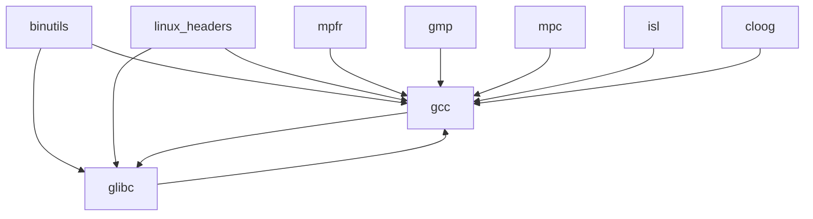

# 1. 准备
## 1.1 环境准备
```bash
mkdir -p /opt/cross_gcc/src
```
## 1.2 模块依赖关系
|模块|作用|
|--|--|
|binutils|包含了連結器(Linker)，組譯器(assembler)，和其他處理物件檔案的工具|
|gcc|內容是GNU compiler collection, 其中包含了C 和 C++編譯器|
|linux|由linux kernel API所匯出的表頭檔，是要給Glibc用的|
|glibc|C函数库，为Linux系统提供底层API支持，封装了操作系统服务并实现文件操作、字符串处理、内存管理等基础功能|
|mpfr|內容是多精度数值运算函数库|
|gmp|这个套件包含了一些多精度数值运算的函式库，建立GCC需要用到|
|mpc|也是包含一些多精度运算的函式库，建立GCC需要用到|
|ISL(opt)和cloog(opt)|使用ISL和cloog這兩個套件可以允許一些編譯的最佳化，但是也可以不用|

## 1.2 源码(尽量使用国内源保证下载速度)
```bash
cd /opt/cross_gcc/src
cat << EOF > src_list
https://mirrors.tuna.tsinghua.edu.cn/gnu/binutils/binutils-2.45.tar.gz
https://mirrors.tuna.tsinghua.edu.cn/gnu/gcc/gcc-15.1.0/gcc-15.1.0.tar.gz
https://mirrors.tuna.tsinghua.edu.cn/gnu/glibc/glibc-2.42.tar.gz
https://mirrors.tuna.tsinghua.edu.cn/gnu/mpfr/mpfr-4.2.2.tar.gz
https://mirrors.tuna.tsinghua.edu.cn/gnu/gmp/gmp-6.3.0.tar.gz
https://mirrors.tuna.tsinghua.edu.cn/gnu/mpc/mpc-1.3.1.tar.gz
https://mirrors.aliyun.com/linux-kernel/v6.x/linux-6.1.123.tar.gz
https://gcc.gnu.org/pub/gcc/infrastructure/isl-0.24.tar.bz2
ftp://gcc.gnu.org/pub/gcc/infrastructure/cloog-0.18.1.tar.gz
EOF
# 下载源码包
wget --input-file=src_list --continue --directory-prefix=/opt/cross_gcc/src
# 解压软件源码包
ls *.tar.gz |xargs -n1 tar -zxf # 解压.tar.gz包
ls *.tar.bz2 |xargs -n1 tar -jxf # 解压.tar.bz2包
```
## 1.3 设置环境变量
```bash
# 此处编译aarch64-linux-gnu
export TARGET=aarch64-linux-gnu
export BUILD_ROOT=/opt/cross_gcc
export PATH="$BUILD_ROOT/tools/bin:$PATH"
export SYSROOT="$BUILD_ROOT/sys-root"
mkdir -p "$SYSROOT"
```
# 2 开始编译
## 2.3 安装linux_header
```bash
cd $BUILD_ROOT/src/linux-6.1.123
make ARCH=arm64 INSTALL_HDR_PATH="$SYSROOT/usr" headers_install
```
## 2.1 编译binutils
```bash
cd $BUILD_ROOT/src/binutils-2.45
mkdir build && cd build
../configure --prefix=$BUILD_ROOT/tools --with-sysroot=$SYSROOT --target=$TARGET --disable-nls --disable-werror
make -j$(nproc)
make install
```
|选项|描述|
|--|--|
|prefix=$BUILD_ROOT/tools|这告诉配置脚本准备将 Binutils 程序安装在 $BUILD_ROOT/tools 目录中|
|with-sysroot=$BUILD_ROOT|该选项告诉构建系统，交叉编译时在 $BUILD_ROOT 中寻找目标系统的库|
|target=$TARGET|由于TARGET变量中的机器描述和config.guess脚本的输出略有不同, 这个开关使得configure脚本调整 Binutils 的构建系统，以构建交叉链接器|
|disable-nls|该选项禁用临时工具不需要的国际化功能|
|enable-gprofng=no|该选项禁用临时工具不需要的 gprofng 工具|
|disable-werror|该选项防止宿主系统编译器警告导致构建失败|
|enable-default-hash-style=gnu|默认情况下，链接器会为共享库和动态链接的可执行文件同时生成 GNU 风格的散列表和经典的 ELF 散列表。散列表仅供动态链接器进行符号查询。BUILD_ROOT 系统的动态链接器 (由 Glibc 软件包提供) 总是使用查询更快的 GNU 风格散列表。因此经典 ELF 散列表完全没有意义。该选项使得链接器在默认情况下只生成 GNU 风格散列表，以避免为生成和存储经典 ELF 散列表浪费时间和空间|
## 2.2 第一次编译 gcc
```bash
cd $BUILD_ROOT/src/gcc-15.1.0
# 创建软连接
ln -s ../mpfr-4.2.2 mpfr
ln -s ../gmp-6.3.0 gmp
ln -s ../mpc-1.3.1 mpc
ln -s ../isl-0.24 isl
ln -s ../cloog-0.18.1 cloog
# 创建编译目录
mkdir build && cd build
../configure --target=$TARGET --prefix=$BUILD_ROOT/tools --with-glibc-version=2.42 --with-sysroot=$BUILD_ROOT --with-newlib --without-headers --enable-default-pie --enable-default-ssp --disable-nls --disable-shared --disable-multilib --disable-threads --disable-libatomic --disable-libgomp --disable-libquadmath --disable-libssp --disable-libvtv --disable-libstdcxx --enable-languages=c,c++
make -j$(nproc)
make install
```
|选项|描述|
|---|---|
|with-glibc-version=2.42|
该选项指定目标系统将要使用的 Glibc 版本。这与宿主系统的 libc 没有关系，因为第一遍的 GCC 产生的所有代码都会在与宿主系统的 libc 完全隔离的 chroot 环境中运行|
|with-newlib|由于现在没有可用的 C 运行库，使用该选项保证构建 libgcc 时 inhibit_libc 常量被定义，以防止编译任何需要 libc 支持的代码|
|without-headers|在创建完整的交叉编译器时，GCC 需要与目标系统兼容的标准头文件,目前还没有对应的头文件|
|enable-default-pie<br>enable-default-ssp|它们使得 GCC 在编译程序时默认启用一些增强安全性的特性 (详见第 8 章中的关于 PIE 和 SSP 的说明)。在本阶段并没有使用它们的必要性，但是尽早使用它们能够使得临时安装和最终安装的软件包更相近，这样构建过程更加稳定|
|disable-shared|这个开关强制GCC静态链接它的内部库。我们必须这样做，因为动态库需要目标系统中尚未安装的Glibc|
|disable-multilib|交叉编译不需要支持多平台|
disable-threads<br>disable-libatomic<br>disable-libgomp<br>disable-libquadmath<br>disable-libssp<br>disable-libvtv<br>disable-libstdcxx|这些开关禁用对于线程、libatomic、libgomp、libquadmath、libssp、libvtv，以及 C++ 标准库的支持。在构建交叉编译器时它们可能编译失败，而且在交叉编译临时 libc 时并不需要它们|
|enable-languages=c,c++|这个选项保证只构建 C 和 C++ 编译器。目前只需要这两个语言|

## 2.4 编译glibc
```bash
cd $BUILD_ROOT/src/glibc-2.42
# 创建编译目录
mkdir build && cd build
../configure --prefix=/usr --host=$TARGET --build=$(../scripts/config.guess) --enable-kernel=6.1 --with-headers=$BUILD_ROOT/sys-root/usr/include --disable-nscd libc_cv_slibdir=/usr/lib
make -j$(nproc)
# make DESTDIR=$BUILD_ROOT install
make install_root=$SYSROOT install
```
|选项|描述|
|--|--|
|prefix=/usr| 安装路径，此处也可以直接写成 prefix=$BUILD_ROOT/usr，这样make install的时候不需要指定 DESTDIR|
|host=$LFS_TGT<br>build=$(../scripts/config.guess)|在它们的共同作用下，Glibc 的构建系统将自身配置为使用 $LFS/tools 中的交叉链接器和交叉编译器，进行交叉编译|
|enable-kernel=6.1|该选项告诉 Glibc 编译出支持 6.1 版或者更新的 Linux 内核，这样就不会使用那些为更老内核准备的替代方案|
|with-headers=$BUILD_ROOT/$TARGET/usr/include|该选项告诉 Glibc 在编译过程中，使用 $LFS/usr/include 目录中的头文件，这样它就知道内核拥有哪些特性，并据此对自身进行优化|
|libc_cv_slibdir=/usr/lib|在 64 位机器上，这保证将库安装到 /usr/lib，而不是默认的 /lib64|
|disable-nscd|不构建目前已经没有作用的命名服务缓存守护程序|
## 2.5 第二遍编译gcc(完整版)
```bash
cd $BUILD_ROOT/src/gcc-15.1.0
../configure --target=$TARGET --prefix=$BUILD_ROOT/tools --with-sysroot=$SYSROOT --enable-languages=c,c++ --enable-shared --enable-threads=posix
make -j$(nproc)
make install
‵‵‵
# 3 测试
```bash
cat << EOF > main.cpp
#include <iostream>

int main()
{
        std::cout << "test c++" << std::endl;
        return 0;
}
EOF
aarch64-linux-gnu-g++  -static main.cpp -o test
qemu-aarch64 test  # 能正常运行表示第一步已经完成
```
