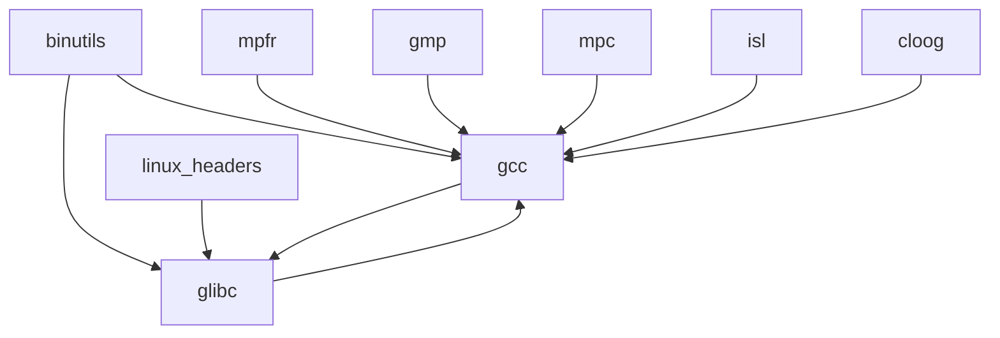

# 1. 准备
## 1.1 环境准备
```bash
mkdir -p /opt/cross_gcc_test/src
```
## 1.2 模块依赖关系
|模块|作用|
|--|--|
|binutils|包含了連結器(Linker)，組譯器(assembler)，和其他處理物件檔案的工具|
|gcc|內容是GNU compiler collection, 其中包含了C 和 C++編譯器|
|linux|由linux kernel API所匯出的表頭檔，是要給Glibc用的|
|glibc|C函数库，为Linux系统提供底层API支持，封装了操作系统服务并实现文件操作、字符串处理、内存管理等基础功能|
|mpfr|內容是多精度数值运算函数库|
|gmp|这个套件包含了一些多精度数值运算的函式库，建立GCC需要用到|
|mpc|也是包含一些多精度运算的函式库，建立GCC需要用到|
|ISL(opt)和cloog(opt)|使用ISL和cloog這兩個套件可以允許一些編譯的最佳化，但是也可以不用|

## 1.2 源码(尽量使用国内源保证下载速度)
```bash
cd /opt/cross_gcc_test/src
cat << EOF > src_list
https://mirrors.tuna.tsinghua.edu.cn/gnu/binutils/binutils-2.45.tar.gz
https://mirrors.tuna.tsinghua.edu.cn/gnu/gcc/gcc-15.1.0/gcc-15.1.0.tar.gz
https://mirrors.tuna.tsinghua.edu.cn/gnu/glibc/glibc-2.42.tar.gz
https://mirrors.tuna.tsinghua.edu.cn/gnu/mpfr/mpfr-4.2.2.tar.gz
https://mirrors.tuna.tsinghua.edu.cn/gnu/gmp/gmp-6.3.0.tar.gz
https://mirrors.tuna.tsinghua.edu.cn/gnu/mpc/mpc-1.3.1.tar.gz
https://mirrors.aliyun.com/linux-kernel/v6.x/linux-6.1.123.tar.gz
https://gcc.gnu.org/pub/gcc/infrastructure/isl-0.24.tar.bz2
ftp://gcc.gnu.org/pub/gcc/infrastructure/cloog-0.18.1.tar.gz
EOF
# 下载源码包
wget --input-file=src_list --continue --directory-prefix=/opt/cross_gcc_test/src
# 解压软件源码包
ls *.tar.gz |xargs -n1 tar -zxf # 解压.tar.gz包
ls *.tar.bz2 |xargs -n1 tar -jxf # 解压.tar.bz2包
```
## 1.3 设置环境变量
```bash
# 设置编译的目标
export TARGET=aarch64-linux-gnu
export PATH=/opt/cross_gcc_test/bin:$PATH
```
# 2 开始编译
## 2.1 编译binutils
```bash
cd /opt/cross_gcc_test/src/binutils-2.45
mkdir build && cd build
../configure --prefix=/opt/cross_gcc_test/ --target=$TARGET
make -j4 && make install
```
## 2.2 安装linux kernel header
```bash
cd /opt/cross_gcc_test/src/linux-6.1.123
make ARCH=arm64 INSTALL_HDR_PATH=/opt/cross_gcc_test/$TARGET headers_install
```
## 2.3 编译gcc（不完整版）
### 2.3.1 创建软连接
```bash
cd /opt/cross_gcc_test/src/gcc-15.1.0
ln -s ../mpfr-4.2.2 mpfr
ln -s ../gmp-6.3.0 gmp
ln -s ../mpc-1.3.1 mpc
ln -s ../isl-0.24 isl
ln -s ../cloog-0.18.1 cloog
```
### 2.3.2 开始编译
```bash
cd /opt/cross_gcc_test/src/gcc-15.1.0
mkdir build && cd build
# --with-headers 此处主要是为了解决后期编译查找头文件sys-include目录导致的问题，目前关联 PR 115415
# https://patchwork.sourceware.org/project/gcc/patch/20240614121218.63375-1-syq@gcc.gnu.org/
../configure --prefix=/opt/cross_gcc_test --target=$TARGET --enable-languages=c,c++ --disable-multilib --with-headers=/opt/cross_gcc_test/$TARGET/include/linux/
make -j4 all-gcc  # 此处注意只编译all-gcc
make install-gcc  # 同理只安装gcc
```
## 2.4 编译glibc(不完整版)
```bash
cd /opt/cross_gcc_test/src/glibc-2.42
mkdir build && cd build
../configure --prefix=/opt/cross_gcc_test/$TARGET --build=$MACHTYPE --host=$TARGET --target=$TARGET  --with-headers=/opt/cross_gcc_test/$TARGET/include --disable-multilib libc_cv_forced_unwind=yes
make install-bootstrap-headers=yes install-headers
make -j4 csu/subdir_lib
install csu/crt1.o csu/crti.o csu/crtn.o /opt/cross_gcc_test/$TARGET/lib
aarch64-linux-gnu-gcc -nostdlib -nostartfiles -shared -x c /dev/null -o /opt/cross_gcc_test/$TARGET/lib/libc.so
touch /opt/cross_gcc_test/$TARGET/include/gnu/stubs.h
```
## 2.5 编译gcc
```bash
cd /opt/cross_gcc_test/src/gcc-15.1.0/build
make -j4 all-target-libgcc
make install-target-libgcc
```
## 2.6 编译glibc
```bash
cd /opt/cross_gcc_test/src/glibc-2.42/build
make -j4
make install
```
## 2.7 编译libstdc++
```bash
cd /opt/cross_gcc_test/src/gcc-15.1.0/build
# 下面遇到这个错误的时候，注释掉 unsigned struct_termio_sz = sizeof(struct termio);
# error: invalid application of ‘sizeof’ to incomplete type ‘__sanitizer::termio’ 
make -j4
make install
```
